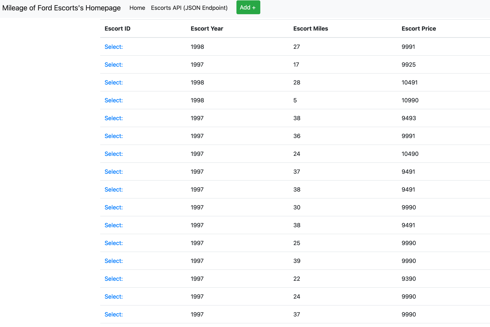

** Part Three **
Attempting to get my own version of the project/assignment
to properly function.

# Screenshot: View of data tables in PyCharm

# Screenshot: Browser displaying homepage with data

# Screenshot: Browser displaying data record as a view of one record

# Screenshot: New record(s) added to homepage

# Screenshot: Deleted record(s) from homepage
